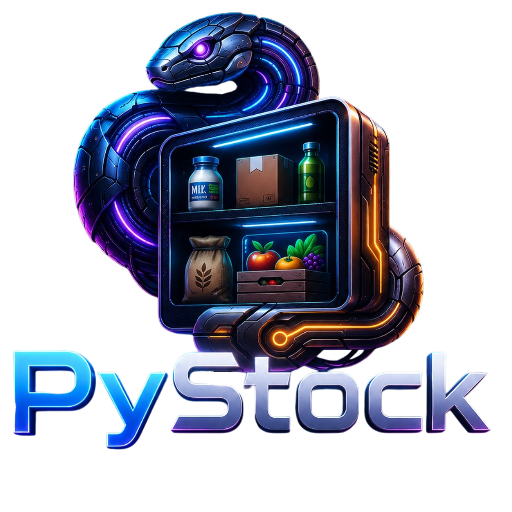

# PyStock

<p align="center">
  
</p>

### 📺 [Video Demo: Watch PyStock in Action](https://youtu.be/qNxvnkJ_SM4?si=92NlkkqoxEHzGBX9)

[](https://www.python.org/)
[](https://opensource.org/licenses/MIT)
[]()
[]()

**PyStock** is a robust inventory management system built in Python with SQLite database backend. It features a practical, color-coded CLI (Command Line Interface) with complete CRUD functionality, advanced search capabilities, and persistent data storage.

## Overview

PyStock was developed to simplify inventory control, allowing users to manage their stock efficiently through a modern terminal interface with visual feedback and validation. With a modular, object-oriented architecture and well-designed components, the project provides a solid foundation for future expansions to web platforms, APIs, and enterprise features.

**Status:** Full CRUD + Advanced Features | **Current Version:** 0.1.5 | **Focus:** Stability & Quality

---

## ✨ Key Features

| Feature | Status | Description |
|---|---|---|
| **Item Registration** | ✓ Done | Add items with name, quantity, and price |
| **Inventory Listing** | ✓ Done | Color-coded display with stock status indicators |
| **Item Removal** | ✓ Done | Remove items by ID or name with confirmation |
| **Item Update** | ✓ Done | Modify name, quantity, and price with validation |
| **Advanced Search** | ✓ Done | Search by item ID or name (case-insensitive) |
| **Stock Status** | ✓ Done | Real-time status display (OK, LOW, OUT OF STOCK) |
| **Colored UI** | ✓ Done | ANSI color-coded interface for better readability |
| **SQLite Database** | ✓ Done | Persistent data storage with automatic initialization |

---

## Quick Start

### Prerequisites
- Python 3.8 or higher
- Operating system: Windows, macOS, or Linux
- No external dependencies (uses only Python standard libraries)

### Installation

```bash
# Clone the repository
git clone https://github.com/luke-lynx/pystock.git
cd pystock

# Optional: Create a virtual environment
python -m venv venv
source venv/bin/activate  # On Windows: venv\Scripts\activate
```

### Running PyStock

```bash
# From the project root, run:
python src/main.py

# You will be greeted with the welcome screen and main menu
```

The database (`data/pystock.db`) is created automatically on first run.

---

## Usage Guide

### 1. Add Item

```
Main Menu → Option 1 (Add Food Item)
├─ Enter the item name
├─ Enter the quantity
├─ Enter the price per unit
└─ Confirm the data
```

**Features:**
- ✓ Input validation (non-negative numbers)
- ✓ Price validation (positive values)
- ✓ Automatic ID generation
- ✓ Immediate SQLite persistence
- ✓ Confirmation prompt before saving
- ✓ Cancel option (type 'S' or 'Y' at any prompt)

**Example:**
```
> Item Name: Rice 5kg
> Initial Quantity: 100
> Price per Unit: 25.50
✔ Item confirmed for addition!
```

---

### 2. List Inventory

```
Main Menu → Option 4 (List Inventory)
```

**Displayed Information:**
- **ID**: Unique item identifier
- **Item Name**: Product name (truncated at 30 chars)
- **QTY**: Current stock quantity
- **PRICE**: Price per unit
- **STATUS**: Stock level indicator

**Status Indicators:**
- 🟢 **OK**: Quantity > 5 units
- 🟡 **LOW**: Quantity between 1–5 units
- 🔴 **OUT OF STOCK**: Quantity = 0

**Example Output:**
```
==================== PYSTOCK - CURRENT INVENTORY ====================
ID   | ITEM NAME                      | QTY  | PRICE        | STATUS
─────────────────────────────────────────────────────────────────────
1    | Rice 5kg                       | 100  | 25.50        | OK
2    | Beans Premium                  | 3    | 15.00        | LOW
3    | Pasta Regular                  | 0    | 5.99         | OUT OF STOCK
─────────────────────────────────────────────────────────────────────
Total items listed: 3
```

---

### 3. Remove Item

```
Main Menu → Option 2 (Remove Food Item)
├─ Enter Item ID or Name
├─ Confirm the found item
└─ Confirm removal (⚠️ This action cannot be undone)
```

**Features:**
- ✓ Search by ID (numeric)
- ✓ Search by name (case-insensitive)
- ✓ Item preview before confirmation
- ✓ Double confirmation to prevent accidents
- ✓ Cancel option available

**Example:**
```
> Enter Item ID or Name: 1
Item found: 'Rice 5kg' with quantity 100 (ID: 1)
⚠ Are you sure you want to remove this item? (y/n): y
✔ Item removed successfully!
```

---

### 4. Update Item

```
Main Menu → Option 3 (Edit Food)
├─ Search by ID
├─ Modify: name, quantity, and/or price
├─ Review changes before saving
└─ Confirm and save to database
```

**Features:**
- ✓ Search by ID only (for precision)
- ✓ Selective field editing (update one or multiple fields)
- ✓ Real-time validation (non-negative quantity, positive price)
- ✓ Summary of changes before confirmation
- ✓ Instant database update

**Example:**
```
>>> IDENTIFIER QUERY (ID)
Enter item numeric ID: 1

[ ITEM RECORD FOUND ]
ID: 1
Name: Rice 5kg
Quantity: 100
Price: 25.50

Change name 'Rice 5kg'? (y/n): y
Enter new name: Premium Rice 10kg

Change quantity '100'? (y/n): y
Enter new quantity: 80

Change price '25.50'? (y/n): n

==================== CHANGES SUMMARY ====================
ID: 1
Name: Rice 5kg → Premium Rice 10kg
Quantity: 100 → 80
Price: 25.50 → 25.50

Confirm changes? (y/n): y
[SUCCESS]: Item updated successfully!
```

---

## Architecture

### Directory Structure

```
pystock/
├── src/
│   ├── main.py                          # Entry point
│   ├── pystock.py                       # Alternative entry point
│   ├── python_db_manager.py             # SQLite database interface
│   ├── pystockui.py                     # UI components & color definitions
│   └── modules/
│       ├── __init__.py                  # Module exports
│       ├── add_item.py                  # AddItemEngine
│       ├── list_item.py                 # ListItem
│       ├── remove_item.py               # RemoveItensEngine
│       └── update_item.py               # UpdateItemEngine
├── data/
│   └── pystock.db                       # SQLite database (auto-created)
├── tests/                               # Test files
├── assets/                              # Project images
├── .gitignore
├── README.md
└── requirements.txt
```

### Module Architecture

```
MainSystem (main.py)
├─ OpenDatabase (python_db_manager.py)
│  └─ SQLite operations (CRUD on stock table)
│
├─ MainPyStockUI (pystockui.py)
│  ├─ MainPyStockUI → Main menu
│  ├─ AddItemUI → Add item form
│  ├─ RemoveItemUI → Remove confirmation
│  └─ UpdateItemUI → Update form
│
└─ Engine Classes (modules/)
   ├─ AddItemEngine
   ├─ RemoveItensEngine
   ├─ UpdateItemEngine
   └─ ListItem
```

### Database Schema

The system uses SQLite with the following table structure:

```sql
CREATE TABLE IF NOT EXISTS stock (
    id INTEGER PRIMARY KEY AUTOINCREMENT,
    name TEXT NOT NULL,
    quantity INTEGER DEFAULT 0,
    price REAL NOT NULL
);
```

**Fields:**
- `id` (INTEGER): Unique identifier, auto-generated
- `name` (TEXT): Product name, required
- `quantity` (INTEGER): Stock quantity, defaults to 0
- `price` (REAL): Price per unit, required

**Features:**
- Automatic ID generation
- Atomic write operations
- UTF-8 encoding support
- Cross-platform compatibility

### Data Flow

```
User Input
    ↓
Validation (input type, range, constraints)
    ↓
Processing (AddItemEngine, RemoveItensEngine, etc.)
    ↓
Database Operation (insert, update, delete, select)
    ↓
SQLite Persistence
    ↓
User Feedback (confirmation, status, error messages)
```

---

## Technologies Used

| Technology | Version | Purpose |
|---|---|---|
| Python | 3.8+ | Core language |
| SQLite | 3.x | Database engine |
| Pathlib | Standard | Cross-platform path handling |
| OS | Standard | Terminal operations |
| Time | Standard | UI transitions & delays |

**Standard Library Only:**
- No external dependencies required
- Fully portable across platforms
- Easy deployment and installation

---

## Advanced Features

### 🎨 Color-Coded Interface
- Green: Success messages and OK status
- Yellow: Low stock warnings
- Red: Errors and out-of-stock items
- Cyan: Information and loading states

### 🔍 Intelligent Search
- Search items by numeric ID
- Search items by name (case-insensitive, partial match)
- Automatic type conversion for queries
- Multiple results support

### ✅ Comprehensive Validation
- Non-negative quantities
- Positive prices
- Non-empty product names
- Type checking and conversion
- Duplicate prevention via unique IDs

### 🔒 Data Integrity
- Atomic database operations
- Confirmation prompts for destructive actions
- Proper exception handling
- Automatic directory creation
- Transaction-based updates

---

## Versions & Roadmap

### v0.1.x Series - Consolidation (Current)
**Focus:** Core functionality, stability, and UI refinement

- ✓ v0.1.4 - Full CRUD with JSON
- ✓ v0.1.5 - SQLite migration, advanced search, price support
- ⏳ v0.1.6+ - Bug fixes and performance improvements

### v0.2.0 - Enhanced Database Layer (Planned)
**Focus:** Advanced database features

- [ ] Bulk import/export (CSV, Excel)
- [ ] Category/tags support
- [ ] Low stock alerts
- [ ] Inventory history/audit log
- [ ] Backup & restore functionality

### v0.3.0 - API & Web Interface (Planned)
**Focus:** Multi-platform expansion

- [ ] REST API (FastAPI/Flask)
- [ ] Web dashboard (React/Vue)
- [ ] Authentication & multi-user support
- [ ] Mobile-responsive interface

### v0.4.0+ - Enterprise Features (Future)
**Focus:** Scalability and enterprise-grade features

- [ ] PostgreSQL/MySQL support
- [ ] Real-time synchronization
- [ ] Reporting & analytics
- [ ] Integration with payment systems
- [ ] Desktop application (Tkinter/PyQt)

---

## Contributing

Contributions are welcome! This project is actively developed.

### How to Contribute

1. Fork the repository
2. Create a feature branch (`git checkout -b feature/MyFeature`)
3. Make your changes
4. Commit with clear messages (`git commit -m 'Add MyFeature'`)
5. Push to your fork (`git push origin feature/MyFeature`)
6. Open a Pull Request

### Code Standards

- Follow PEP 8 (Python Enhancement Proposal 8)
- Use descriptive variable and function names
- Add comments for complex logic only
- Test changes before committing
- Keep commits atomic and focused

### Reporting Bugs

Found a bug? Please open an issue with:
- Clear description of the problem
- Steps to reproduce
- Expected vs. actual behavior
- Python version and OS
- Error messages/tracebacks if applicable

---

## Troubleshooting

### Issue: Database file not found or corrupted
**Solution:** Delete `data/pystock.db` and restart the program. It will recreate the database automatically.

```bash
rm data/pystock.db
python src/main.py
```

### Issue: "Invalid input" error when adding quantity
**Solution:** Enter only non-negative numbers. Decimals are not supported for quantity.

```
Valid:   0, 1, 100, 9999
Invalid: -5, 3.5, abc, ""
```

### Issue: "Item not found" when removing by ID
**Solution:** Check the item ID using Option 4 (List Inventory). IDs are numeric and auto-generated.

### Issue: Price not accepted
**Solution:** Price must be a positive number. Decimals are allowed.

```
Valid:   1, 25.99, 100.00
Invalid: 0, -10, abc, ""
```

### Issue: Program freezes or runs slowly
**Solution:** This is normal during the first run when the database is being created. Large inventories may take a moment to display.

### Issue: Colors not displaying correctly (Windows)
**Solution:** Use Windows Terminal or upgrade to Windows 10+. Legacy CMD may not support ANSI colors.

### Issue: "ModuleNotFoundError" or import errors
**Solution:** Ensure you're running from the project root and Python path is correct:

```bash
cd /path/to/pystock
python src/main.py
```

---

## Performance Notes

- **Display:** List display optimized for up to 10,000 items
- **Search:** O(n) search complexity, suitable for small to medium inventories
- **Database:** SQLite suitable for single-user, local deployments
- **Scalability:** For 100k+ items, consider PostgreSQL in v0.3.0

---

## Security Considerations

✓ **Data Validation:** All user inputs validated before processing  
✓ **Atomic Operations:** Database writes are atomic  
✓ **Error Handling:** Graceful exception handling with user-friendly messages  
✓ **Path Security:** Cross-platform path handling prevents injection  
✓ **Encoding:** UTF-8 support for international characters  

⚠️ **Limitations:** Local SQLite not suitable for concurrent multi-user access. For production use, upgrade to PostgreSQL.

---

## License

This project is licensed under the MIT License - see the LICENSE file for details.

---

## Credits

**Developed by:** Lucas Barbosa Gomes do Nascimento (@luke-lynx)  
**Original Project:** [PyStock on GitHub](https://github.com/luke-lynx/PyStock)  
**Built with:** ❤️ and Python

---

## Contact & Support

- **GitHub:** [@luke-lynx](https://github.com/luke-lynx)
- **Project Issues:** [GitHub Issues](https://github.com/luke-lynx/pystock/issues)
- **Discussions:** [GitHub Discussions](https://github.com/luke-lynx/pystock/discussions)

---

<p align="center">
<strong>PyStock</strong> - Smart inventory management system for modern terminals
</p>

<p align="center">
Made with Python 🐍 | Open Source 📖 | MIT License 📜
</p>
