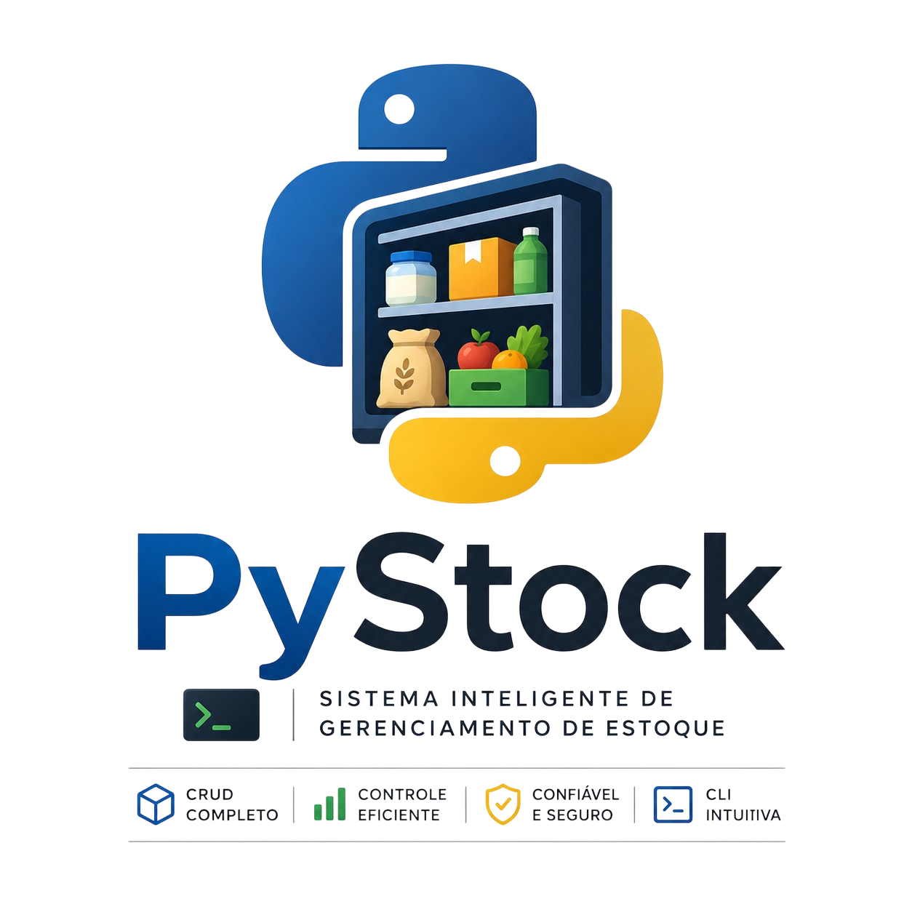

# PyStock

<p align="center">
  
</p>


[](https://www.python.org/)
[](https://opensource.org/licenses/MIT)
[]()
[]()

**PyStock** is a robust food inventory management system built in Python. It offers a practical CLI (Command Line Interface) solution for inventory control with full CRUD functionality, an intuitive interface, and JSON data persistence.

## Overview

PyStock was developed to simplify food inventory control, allowing users to manage their stock efficiently through a terminal. With a modular architecture and well-defined features, the project establishes the core logic for future expansions in later versions.

**Status:** Full CRUD | **Current Version:** 0.1.4 | **Focus:** Stability & Quality

---

## Quick Start

### Prerequisites
- Python 3.8 or higher
- Operating system: Windows, macOS, or Linux

### Installation

```bash
# Clone the repository
git clone https://github.com/luke-lynx/pystock.git
cd pystock

# No external dependencies required
# The project uses only Python standard libraries
```

### First Use

```bash
# From the project root, run:
python src/main.py

# Follow the instructions:
# 1. Confirm the creation of the data file
# 2. Choose whether to add 50 default items
# 3. Use the main menu to manage your inventory
```

---

## Features

| Feature | Status | Description |
|---|---|---|
| Item Registration | ✓ Done | Add new food items with initial quantity |
| Inventory Listing | ✓ Done | View all items with status (OK, LOW, OUT OF STOCK) |
| Item Removal | ✓ Done | Permanently delete records from inventory |
| Data Update | ✓ Done | Change name and quantity by searching via ID or Name |
| CLI Interface | ✓ Done | Intuitive and responsive menu |

---

## Usage Guide

### 1. Add Item

```
Main Menu → Option 1 (Add Food)
├─ Enter the food name
├─ Enter the initial quantity
└─ Confirm the data
```

**Features:**
- Input validation (quantity must be a non-negative number)
- Confirmation before adding
- Automatic ID generation
- Immediate JSON persistence

### 2. List Inventory

```
Main Menu → Option 4 (List Inventory)
```

**Displayed Information:**
- Item ID
- Food name
- Stock quantity
- Category (default: "General")
- Status:
  - **OK**: Quantity > 5 units
  - **LOW**: Quantity between 1–5 units
  - **OUT OF STOCK**: Quantity = 0

### 3. Remove Item

```
Main Menu → Option 2 (Remove Food)
├─ Choose: search by ID or Name
├─ Confirm the found item
└─ Confirm removal
```

### 4. Update Item

```
Main Menu → Option 3 (Edit Food)
├─ Search by ID
├─ Change name and/or quantity
├─ Review the changes
└─ Confirm and save
```

---

## Architecture

### Directory Structure

```
pystock/
├── src/
│   ├── main.py                 # Entry point
│   └── modules/
│       ├── add_item.py         # Create functionality
│       ├── list_item.py        # List functionality
│       ├── remove_item.py      # Delete functionality
│       └── update_item.py      # Update functionality
├── data/
│   ├── user_data.json          # User database
│   └── initial_data.json       # Default data (50 items)
├── .gitignore
└── README.md
```

### Data Model

Each item in the inventory follows this JSON structure:

```json
{
  "id": 1,
  "name": "Rice 5kg",
  "quantity": 100,
  "category": "Grains"
}
```

**Fields:**
- `id` (int): Unique identifier, automatically generated
- `name` (string): Food name
- `quantity` (int): Stock quantity (≥ 0)
- `category` (string): Item classification (extensible for future versions)

### Data Flow

```
CLI Input → Validation → Processing → JSON File → CLI Output
                              ↓
                        Persistence
```

---

## Versions & Roadmap

### v0.1.x Series - Consolidation
**Focus:** Core logic stability and CLI interface refinement

- v0.1.4 (Current) - Full CRUD
- v0.1.5 - UI/UX improvements and error handling
- v0.1.6+ - Minor adjustments based on feedback

### v0.2.0 - Architectural Refactoring
**Focus:** Migration to OOP (Object-Oriented Programming)

- [ ] Implement classes: `Inventory`, `Item`, `FileManager`
- [ ] Design pattern: Repository Pattern
- [ ] Improve performance and scalability
- [ ] Add logging and debugging

### v0.3.0+ - Platform Expansion

- [ ] REST API (FastAPI/Flask)
- [ ] SQL database (PostgreSQL/SQLite)
- [ ] Web interface (React/Vue)
- [ ] Desktop application (Tkinter/PyQt)
- [ ] PDF reports
- [ ] Product image support

---

## Technologies Used

| Technology | Version | Purpose |
|---|---|---|
| Python | 3.8+ | Main language |
| JSON | - | Data persistence |
| Pathlib | - | Path management |
| OS | - | Terminal operations |

**Libraries Used:**
- `pathlib` - Path manipulation (cross-platform)
- `json` - Data serialization/deserialization
- `os` - Operating system operations
- `time` - Timing control for transitions

---

## Contributing

Contributions are welcome! This project is under active development.

### How to Contribute

1. Fork the repository
2. Create a branch for your feature (`git checkout -b feature/MyFeature`)
3. Commit your changes (`git commit -m 'Add MyFeature'`)
4. Push to the branch (`git push origin feature/MyFeature`)
5. Open a Pull Request

### Code Standards

- Follow PEP 8 (Python Enhancement Proposal 8)
- Use descriptive names for variables and functions
- Add comments for complex logic
- Test features before committing

### Reporting Bugs

Found a bug? Open an [issue](https://github.com/luke-lynx/pystock/issues) with:
- Clear description of the problem
- Steps to reproduce
- Expected vs. observed behavior
- Python version and OS used

---

## Validation & Security

### Implemented Validations

| Field | Validation |
|---|---|
| Item Name | Non-empty, string |
| Quantity | Non-negative integer (≥ 0) |
| ID | Automatically generated, unique |
| Confirmation | Accepts: s, sim, y, yes (case-insensitive) |

### Security Considerations

- JSON file is atomically overwritten on write operations
- Input validation at all interface points
- Exception handling for critical operations
- UTF-8 encoding for special character support

---

## Troubleshooting

### Issue: "user_data.json file not found"
**Solution:** Run the program again and confirm the file creation at startup.

### Issue: "Invalid Value: Please Type Again"
**Solution:** Make sure the quantity entered is a non-negative integer.

### Issue: Item not found when updating
**Solution:** Check the listing (Option 4) to confirm the correct item ID.

### Issue: Program does not run on Windows/Mac
**Solution:** Make sure you have Python 3.8+ installed and use `python` or `python3` according to your setup.

---

## Visual Roadmap

```
v0.1.4 (Current)
    ↓ (Minor adjustments)
v0.1.5 → v0.1.6 → v0.1.x
    ↓ (Full refactoring)
v0.2.0 (OOP + Performance)
    ↓ (Expansion)
v0.3.0+ (Multi-platform + API)
```

---

## Credits

Developed by **@luke-lynx** as a learning project in Computer Engineering.

This project demonstrates:
- Solid programming logic
- File management and data persistence
- Intuitive CLI interface design
- Modular and scalable structure

---

## License

This project is licensed under the MIT License - see the LICENSE file for details.

---

## Contact & Support

- GitHub: [@luke-lynx](https://github.com/luke-lynx)
- Issues: [Open a discussion](https://github.com/luke-lynx/pystock/issues)
- Discussions: [GitHub Discussions](https://github.com/luke-lynx/pystock/discussions)

---

**PyStock** - Smart inventory management system. Built with ❤️ in Python.
